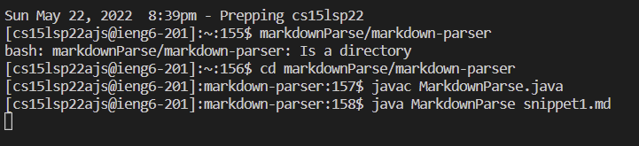
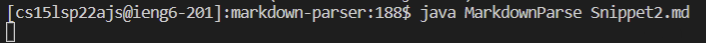
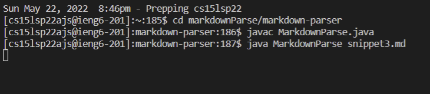

# Lab Report 4

[My repository](https://github.com/cyoonUCSD/markdown-parser)  

[Reviewed repository](https://github.com/JasonMorris1/markdown-parser)  

## Snippets on My Repo  

### Snippet 1 Test
  

**Here is the JUnit Test failing with the first provided Markdown snippet.**
- This test fails because my Markdown Parser is designed to only catch links that begin with "https://" as valid links.
- Lines 26-29 can simply be removed and the JUnit test should not fail.

### Snippet 2 Test
  

**Here is the JUnit Test failing with the second provided Markdown snippet.**
- This test fails because my Markdown Parser is designed to only catch links that begin with "https://" as valid links.
- Lines 26-29 can simply be removed and the JUnit test should not fail.

### Snippet 3 Test
 

**Here is the JUnit Test failing with the third provided Markdown snippet.**
- This test fails because my Markdown Parser is designed to only catch links that begin with "https://" as valid links.
- Lines 26-29 can simply be removed to ammend the "https://" bug.
- This test also fails because my Markdown Parser is designed to indefinitely search for the end of a url, ")", until the end of the file.
- Because of this, the test fails to register "https://cse.ucsd.edu/" as a link and instead takes it to be as part of the github.com url.
- We need to write a code segment such that the code looks for a ")" that is on the same line as the rest of the url.

## Snippets on Reviewed Repo
  

**Here is the JUnit Test failing with the first provided Markdown snippet.**

### Snippet 2 Test
  

**Here is the JUnit Test failing with the second provided Markdown snippet.**

### Snippet 3 Test
 

**Here is the JUnit Test failing with the second provided Markdown snippet.**
