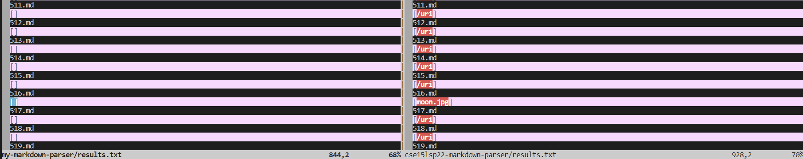

# Lab Report 5

To compare the outputs of my MarkdownParser and the provided Lab 9 MarkdownParser, I ran the command

`vimdiff my-markdown-parser/results.txt cse15lsp22-markdown-parser/results.txt`

in my terminal such that it would become a split screen comparing the contents of the two result files. 
By doing so, I was able to find the highlighted tests where there were differences in output.

[Test 472](https://github.com/nidhidhamnani/markdown-parser/blob/8dd87e6914ae40a4321aac8e2483e349de40b03c/test-files/472.md) is one example of a test with differences.

The correct output according to CommonMark is as below:

These are the outputs shown in through `vimdiff`. The left is my own MarkdownParser and the right is the one provided.

The expected output is `/url` but my MarkdownParser did not list anything. The MarkdownParser provided from the lab, however,
properly outputted `/url`

This is caused by the segment of my code filtering out any urls that do not begin with "https://". If a detected url does not
start with this, then it is disregarded as a link. I just need to remove that particular "https://" filter and everything will work perfectly fine. 
***
[Test 516](https://github.com/nidhidhamnani/markdown-parser/blob/8dd87e6914ae40a4321aac8e2483e349de40b03c/test-files/516.md) is another example of a test with differences.

The correct output to CommonMark is as below:

These are the outputs shown in through `vimdiff`. The left is my own MarkdownParser and the right is the one provided.

The expected output is `/uri`, which neither MarkdownParser correctly identified. The MarkdownParser provided from the lab
outputted `moon.jpg`. My MarkdownParser outputted `[]`.

This is caused by the lab's MarkdownParser and my MarkdownParser incorrectly identifying `moon.jpg` as a link instead of an image,
and my MarkdownParser filtering the link out because it is not in the `https://` format. To fix this, I will need to implement code
that will look for a `!` in front of `[` to register the `` as an image. However, this is the name/icon for the actual link, `/uri`,
so I will have to implement code that is able to look at images within urls. In other words, I need to be able to identify if `[` is followed up with
an image, a `]`, and a `(` followed by a url per usual. This could be done with a nested loop if needed.

