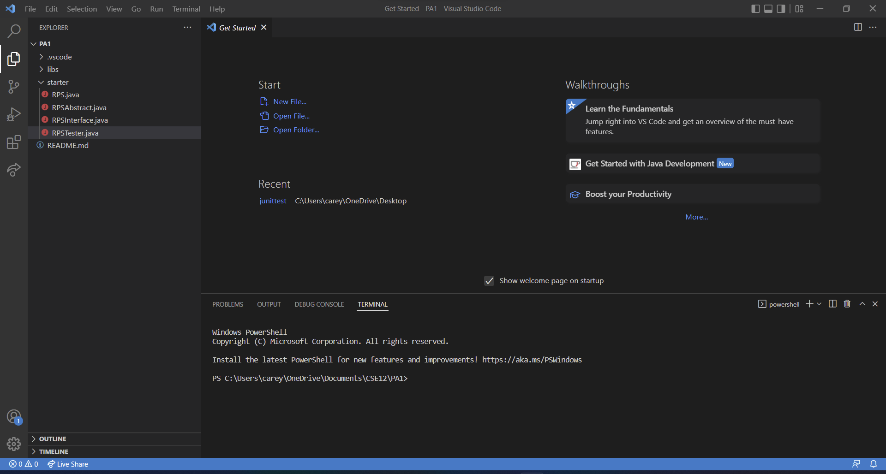
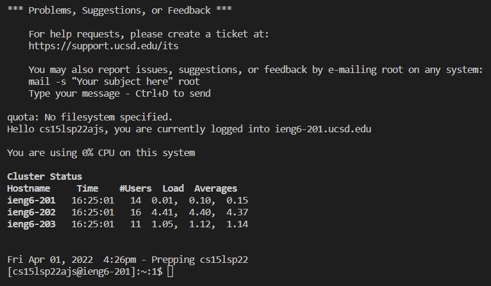
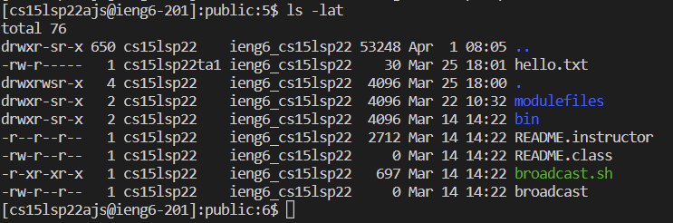
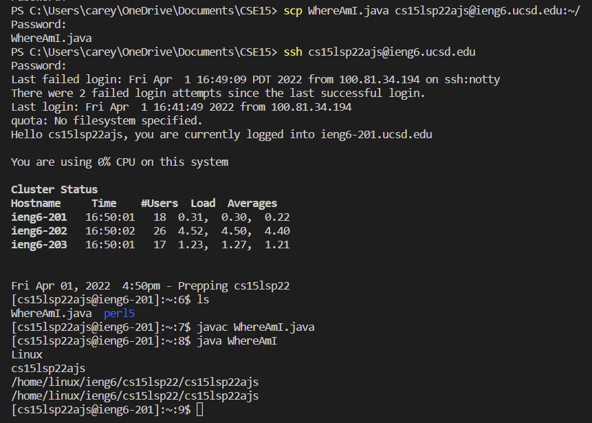
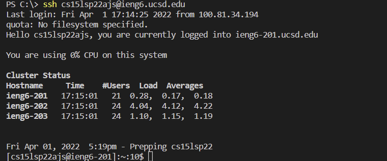

# Tutorial: How to log into your account on ieng6 (CSE15L)

## Install VSCode

- Install VSCode through https://code.visualstudio.com/docs/setup/windows for Windows.
- Alternatively, install through https://code.visualstudio.com/docs/setup/mac for macOS.

## Remotely connect

- Install OpenSSH if on Windows OS
- Look up your account on https://sdacs.ucsd.edu/~icc/index.php
- Open the terminal in VSCode and enter "ssh cs15lsp22zz@ieng6.ucsd.edu", where zz is your account-specific combination
- Enter "yes", then your password to enter.

## Trying Commands

- Try using common commands in your terminal
- Ex. Use "cd" to change directories
- Ex. Use "ls -lat" to display all files w/ file information in the directory
- Ex. Use "ls -a" to display all files w/o file information in the directory
- Ex. Use "cat" to display the text within a file

## Moving Files with scp

- Create a java file and compile it using "javac"
- Enter "scp filename.java cs15lsp22zz@ieng6.ucsd.edu:~/", where "filename" is your java file's name and "zz" refers to account code
- Log in through the "ssh" command
- Enter "ls" to find your java file on the server
- Enter "java" to run the java file

## Setting an SSH Key

- Enter "ssh-keygen"
- If on Windows, run "ssh-keygen -t ed25519"
- Enter in the file directory to save the SSH keys
- Do not add a passphrase afterwards
- Log into your account using "ssh"
- Run "mkdir .ssh"
- Run "scp /Users/<user-name>/.ssh/id_rsa.pub cs15lsp22zz@ieng6.ucsd.edu:~/.ssh/authorized_keys", where "zz" is the account code and "user-name" is your username.

## Optimizing Remote Running
- Log in using ssh, but add "ls" at the end of the command
- This will cut down log-in time by not using a key or a passphrase.
